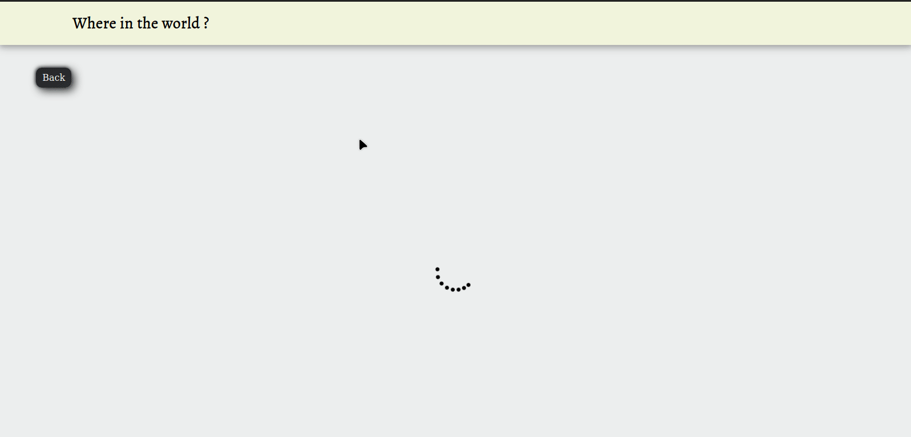

# Where in the world
##### Live site: https://whereinthecountry.netlify.app

It's a simple react app which show data about countries.

  - Show data of Country
  - Show detail data.
  - Search By Country
  - Filter by Region


 


# Used Modules & API
Modules:
  - React
  - Axios
  - React-router

API:
 - https://restcountries.eu/

### Installation

Where in the County requires [Node.js](https://nodejs.org/) v4+ to run.

Install the dependencies and devDependencies and start the server.

```sh
$ cd where_in_the_country
$ npm install
$ npm start
```

### Development

Want to contribute? Great!
Just fork the repository and create a pull request with your ideas.

License
----
**Free Software, Hell Yeah!**
